# W7 Evidence Pack — Team 14 BudgetBot

## 1. Cover

| Item | Value |
|---|---|
| Team | Team 14 / G14 |
| Domain | FinTech — AI Money Coach / BudgetBot |
| Live public URL | https://budgetbot.topjob.id.vn |
| CloudFront URL | https://d104yk0i41rvg5.cloudfront.net |
| API endpoint | https://mlhwir8gc5.execute-api.ap-southeast-1.amazonaws.com |
| GitHub repo | https://github.com/anons2003/team14-repo |
| AWS account | 325137989598 |
| AWS region | ap-southeast-1 |
| CloudFormation stack | team14-budgetbot-iac |
| Total spend | TODO: fill from Friday pre-demo Cost Explorer screenshot |
| Hard cap | $100/group |
| Budget alert | W7-Team14-HardCap-100USD, $100 monthly cost budget |
| Confirmed SNS email | truclt0311@gmail.com |

### Required Submission Artifacts

| Artifact | Status | Evidence |
|---|---:|---|
| Live HTTPS URL | Done | `https://budgetbot.topjob.id.vn` returns HTTP 200 through CloudFront |
| GitHub repo | Done | `https://github.com/anons2003/team14-repo` |
| Final architecture diagram | Done | `docs/architecture.png` |
| Evidence Pack | Done | `docs/W7_evidence.md` |
| Demo video | Done | [Google Drive demo video](https://drive.google.com/file/d/1oH1wG4hl6nWI2Uhk2RK6m-2kBWuROAQh/view) |
| Slides PDF | Done | `docs/slides.pdf` |
| Teardown confirmation | Planned | `docs/teardown_confirmation.md` after Sun 1/6 EOD |

## 2. Pitch And Vision

BudgetBot is an AI Money Coach for people who want a quick, explainable view of where their money went. A user uploads a bank statement CSV, BudgetBot stores the raw file, classifies each transaction with Amazon Bedrock, persists categorized transactions, and shows category summaries plus a review queue for low-confidence classifications.

Target users are students, young professionals, and small business owners who do not want to manually label every transaction. The real-world parallel is Money Lover, YNAB, Spendee, Monzo/Revolut spending insights, and Cake by VPBank. The domain matters because personal finance data is messy: bank descriptions are short, merchant names are inconsistent, and some rows are ambiguous or opaque. The AI feature is useful only if the system also exposes confidence and lets users correct low-confidence output.

### Demo Story

1. Trainer opens `https://budgetbot.topjob.id.vn`.
2. Upload `sample_data/bank_statement_q2_2026.csv`.
3. Lambda stores the raw CSV in S3.
4. Lambda sends transaction descriptions to Amazon Bedrock InvokeModel.
5. Bedrock returns JSON-only category and confidence.
6. Lambda persists transactions in DynamoDB.
7. UI refreshes summary, transaction list, AI performance, failure cases, and review queue.
8. Data remains visible after browser refresh because DynamoDB stores the state.

### Attached Demo Evidence

| Screenshot | File | Notes |
|---|---|---|
| Demo video | [Google Drive demo video](https://drive.google.com/file/d/1oH1wG4hl6nWI2Uhk2RK6m-2kBWuROAQh/view) | Backup 3-minute demo video |
| Live URL home | `docs/evidence_screenshots/demo/01_live_url_home.png` | TODO: attach public HTTPS landing page screenshot |
| Upload success | `docs/evidence_screenshots/demo/02_upload_success.png` | Shows CSV upload and classified transaction output |

#### Upload Success

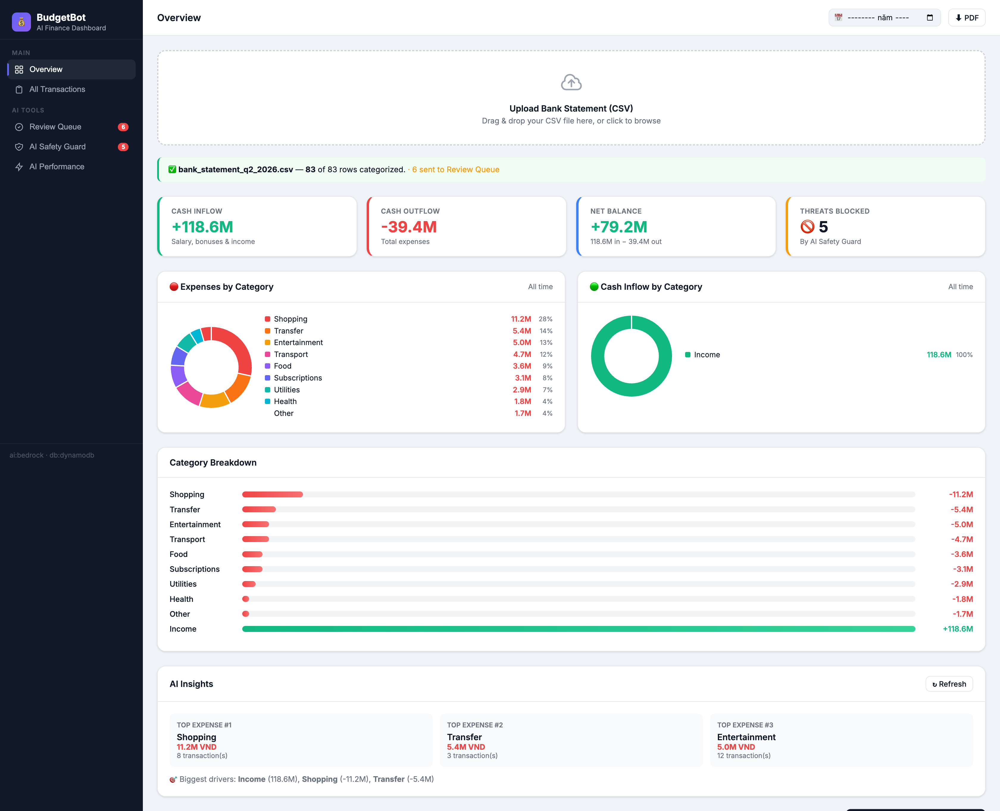

## 3. Architecture

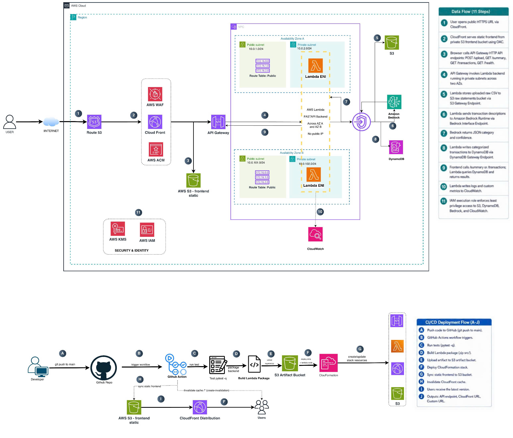

### Architecture Summary

Runtime path:

`Users -> Route 53 -> CloudFront HTTPS -> private S3 frontend -> API Gateway HTTP API -> Lambda FastAPI -> S3 raw bucket / Bedrock Runtime / DynamoDB / CloudWatch`

Deployment path:

`Developer push -> GitHub Actions -> pytest -> build Lambda zip -> S3 artifact bucket -> CloudFormation deploy -> S3 frontend sync -> CloudFront invalidation`

### 7 Mandatory Capabilities

| # | Capability | Implemented Service | Evidence / Resource | Why This Choice |
|---:|---|---|---|---|
| 1 | User-Facing Entry | Route 53 + CloudFront + S3 static frontend + API Gateway HTTP API | `budgetbot.topjob.id.vn`, CloudFront `E349TWP6TRPSOC`, API `mlhwir8gc5` | CloudFront gives public HTTPS and private S3 origin access. API Gateway HTTP API is cheaper and simpler than REST API for Lambda proxy routes. |
| 2 | Application Compute | AWS Lambda running FastAPI through Mangum | `team14-budgetbot-cfn-backend`, Python 3.12, 512 MB, 30s timeout | CSV parsing and classification are request-driven. Lambda avoids idle server cost and deploys quickly for a 48-hour hackathon. |
| 3 | AI / ML Feature | Amazon Bedrock Runtime InvokeModel | `AI_MODEL_ID=apac.amazon.nova-micro-v1:0` | BudgetBot classification is a direct per-transaction reasoning task, not RAG. InvokeModel is simpler and cheaper than building a Knowledge Base. |
| 4 | Data Persistence | DynamoDB | `team14-budgetbot-cfn-transactions`, PK `user_id`, SK `sk`, PAY_PER_REQUEST, PITR enabled | Access pattern is user/month transaction lookup and category summary. DynamoDB keeps ops low and avoids RDS instance/proxy cost. |
| 5 | Object Storage | Amazon S3 | raw bucket `team14-budgetbot-cfn-raw-325137989598-ap-southeast-1`, frontend bucket `team14-budgetbot-cfn-frontend-325137989598-ap-southeast-1`, artifact bucket `team14-budgetbot-artifacts-325137989598-ap-southeast-1` | S3 is the correct primitive for raw CSV upload, static frontend, and Lambda artifacts. |
| 6 | Network Foundation | VPC, private subnets across 2 AZs, security groups, VPC endpoints, no NAT Gateway | VPC `vpc-044f26a2a760491ba`; private subnets `subnet-0acedaa53e5480c96`, `subnet-0f404f193e6534efd`; endpoints for S3, DynamoDB, Bedrock Runtime, CloudWatch Monitoring | Lambda has no public IP. Private subnets use AWS service endpoints instead of NAT to reduce cost and keep AWS traffic private. |
| 7 | Identity & Access | IAM least-privilege Lambda execution role | `arn:aws:iam::325137989598:role/team14-budgetbot-cfn-lambda-role` | Capability #7 requires least-privilege service roles. User login is optional for this hackathon, so the app uses a demo `X-User-Id` pattern instead of spending time on Cognito. |

### Optional Capability Selected

Team 14 selected **Optional #8 — Full Observability**.

| Requirement | Implementation | Status |
|---|---|---:|
| CloudWatch dashboard | `team14-budgetbot-cfn-observability` | Done |
| Custom metric via `PutMetricData` | `UploadSucceeded`, `TransactionsCategorized`, `LowConfidenceTransactions`, `BedrockLatencyMs` in namespace `BudgetBot/Team14` | Done |
| Alarm in OK/ALARM state | `team14-budgetbot-cfn-low-confidence-transactions`, state `OK`, `TreatMissingData=notBreaching` | Done |
| Saved Logs Insights query | `team14-budgetbot-cfn/upload-classification-path`, id `81030937-11c7-4d22-900e-b13f51a6c9d8` | Done |

### Bonus Paths Completed

| Bonus Path | Evidence |
|---|---|
| B. CI/CD pipeline | `.github/workflows/build-and-deploy.yml`; latest runs succeeded on `main` |
| C. Custom domain + HTTPS | Route 53 `budgetbot.topjob.id.vn`, ACM certificate in `us-east-1`, CloudFront alias |
| E. IaC full coverage | `infrastructure/cloudformation.yaml` creates VPC, endpoints, S3, CloudFront, DynamoDB, IAM, Lambda, API Gateway, CloudWatch dashboard/alarm/query |
| F. AI Safety Mechanism | `src/adapters/safety.py` implements prompt injection, SQL injection, and template injection guards. UI Section 7 provides a live testing endpoint. Blocked inputs are persisted and tracked in `GET /stats`. |
| H. Cost under $30 | Pending final Cost Explorer screenshot and clean teardown confirmation |

#### CI/CD Pipeline Evidence

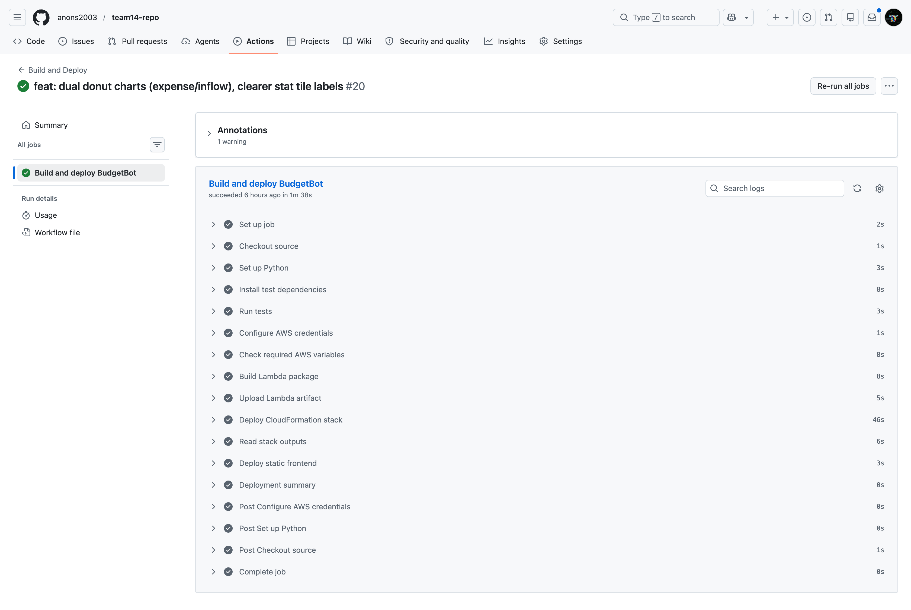

#### Deployment And Demo Screenshots


### Key Service Decisions

| Decision | Choice | Alternative Considered | Rationale |
|---|---|---|---|
| Compute | Lambda | ECS/Fargate or EC2 | Lambda fits bursty upload/API requests and has near-zero idle cost. ECS/EC2 would add container/server management for no demo benefit. |
| API entry | API Gateway HTTP API | REST API or ALB | HTTP API is sufficient for Lambda proxy routes and cheaper than REST API. ALB is more useful for long-running services. |
| Frontend | S3 + CloudFront | Amplify or backend-served frontend | Static HTML/JS is enough for the demo. CloudFront also solves HTTPS and caching. |
| AI path | Bedrock InvokeModel | Bedrock KB/Agent | BudgetBot classifies transaction rows; it does not retrieve knowledge from uploaded documents. |
| Model | Amazon Nova Micro | Larger Claude/Sonnet-style model | Nova Micro is cheaper and sufficient for category classification with JSON-only prompt and review queue fallback. |
| Database | DynamoDB | RDS PostgreSQL | DynamoDB avoids instance cost and supports the simple key-based user/month pattern. App-level aggregation is acceptable at hackathon scale. |
| Network | No NAT, use VPC endpoints | NAT Gateway | S3/DynamoDB gateway endpoints are free and Bedrock/CloudWatch interface endpoints are cheaper than NAT for AWS-only traffic. |
| Identity | IAM least privilege + demo user header | Full Cognito flow | The rule requires IAM least privilege; Cognito is optional. Skipping Cognito protected the 48-hour scope. |
| Observability | CloudWatch dashboard/metrics/alarm/query | External monitoring | CloudWatch is native, covered in W1-W6, and satisfies optional #8 directly. |

## 4. Cost Discipline

### Required Cost Safety

| Requirement | Status | Evidence |
|---|---:|---|
| AWS Budget alert | Done | `W7-Team14-HardCap-100USD`, $100 monthly COST budget |
| SNS email confirmed | Done | `truclt0311@gmail.com`, subscription ARN confirmed |
| Cost Anomaly Detection | Done | Monitor `Default-Services-Monitor`; attach `docs/evidence_screenshots/cost/03_cost_anomaly_detection.png` |
| Tagging convention | Done | `Project=W7Capstone`, `Team=G14`, `Owner=Team14`, `Environment=hackathon` in CloudFormation resources |
| Bedrock access | Done | Lambda health shows `ai=bedrock`; InvokeModel path works through deployed app |
| Cost Explorer screenshots | Partial | Day 1 EOD attached; Day 2 EOD and Friday pre-demo still pending |

### Attached Cost Evidence

| Screenshot | File | Notes |
|---|---|---|
| Budget alert | `docs/evidence_screenshots/cost/01_budget_alert.png` | Show $100 budget / $80 notification |
| SNS confirmation | `docs/evidence_screenshots/cost/02_sns_confirmed.png` | Show confirmed email subscription |
| Cost Anomaly Detection | `docs/evidence_screenshots/cost/03_cost_anomaly_detection.png` | Show active monitor/subscription |
| Day 1 EOD Cost Explorer | `docs/evidence_screenshots/cost/04_cost_explorer_day1_eod.png` | Captures Cost Explorer data availability status at Day 1 EOD |
| Day 2 EOD Cost Explorer | `docs/evidence_screenshots/cost/05_cost_explorer_day2_eod.png` | TODO: include total spend once captured |
| Friday pre-demo Cost Explorer | `docs/evidence_screenshots/cost/06_cost_explorer_friday_predemo.png` | TODO: official total spend once captured |

#### Budget Alert

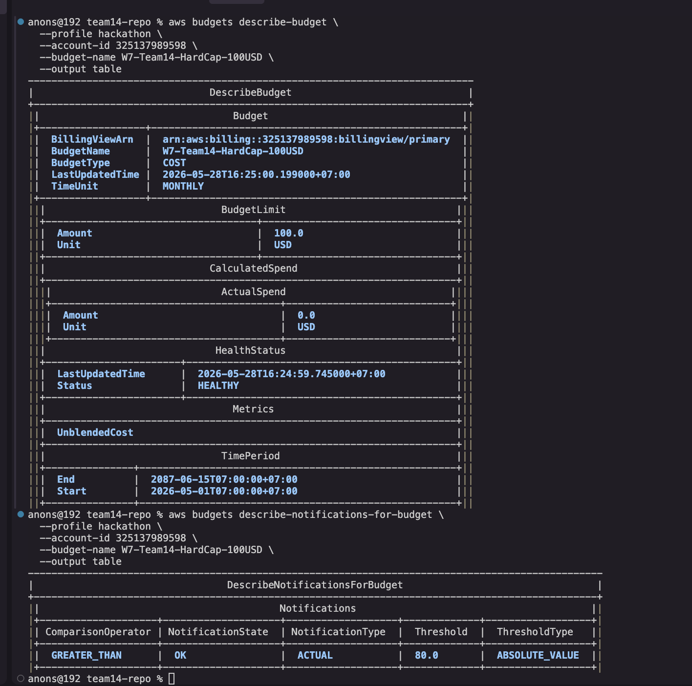

#### SNS Confirmation

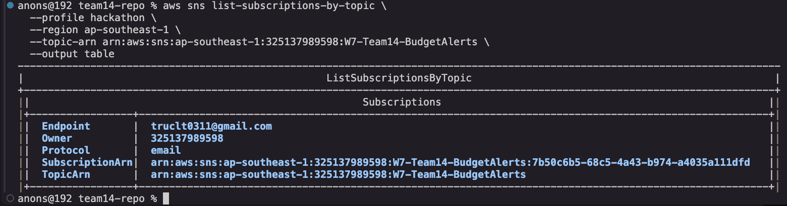

#### Cost Anomaly Detection

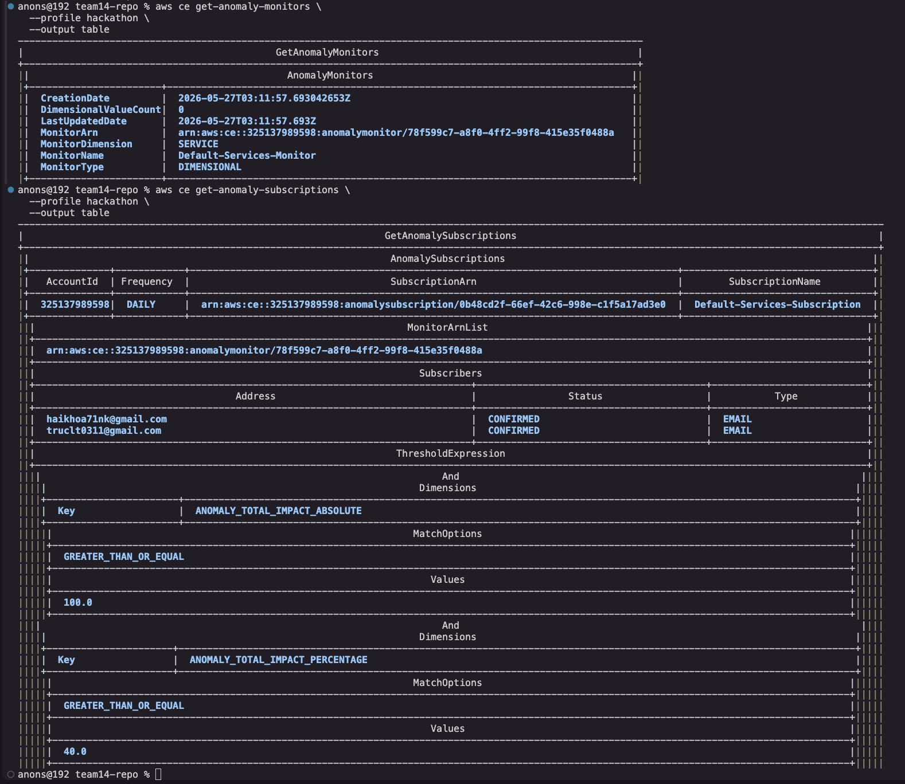

#### Day 1 EOD Cost Explorer

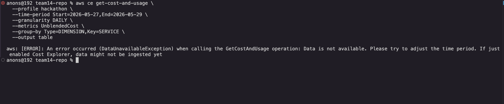

### Expected Cost Drivers

| Driver | Why It Exists | Cost Control |
|---|---|---|
| Bedrock Runtime | AI classification per upload and accuracy test | Use Nova Micro, batch classification, JSON-only short prompt, avoid expensive model loops |
| CloudFront + S3 | Public frontend, raw CSV storage, Lambda artifacts | Static site and low file volume keep this small |
| VPC Interface Endpoints | Private Lambda access to Bedrock Runtime and CloudWatch Monitoring | Avoided NAT Gateway; S3/DynamoDB use free gateway endpoints |
| DynamoDB | Transaction persistence | PAY_PER_REQUEST, small item count, no provisioned capacity |
| Lambda + API Gateway | Backend compute and request entry | Serverless, no idle EC2/RDS cost |

### Cost Observation

AWS Cost Explorer returned `DataUnavailableException` during evidence drafting, which can happen shortly after Cost Explorer is enabled or before daily cost data is ingested. The final Evidence Pack must replace this note with the Friday pre-demo Cost Explorer total and top three service drivers.

## 5. Security

### Security Controls Implemented

| Area | Implementation | Evidence |
|---|---|---|
| Root account safety | Root MFA required by W7 pre-flight | Attach `docs/evidence_screenshots/security/01_root_mfa_enabled.png` from AWS account owner |
| HTTPS public entry | Route 53 + CloudFront + ACM certificate | `budgetbot.topjob.id.vn`; ACM cert `arn:aws:acm:us-east-1:325137989598:certificate/5aece9cc-fd4b-4ebc-a6a5-24ab429455de`; CloudFront TLS minimum `TLSv1.2_2021` |
| Private frontend bucket | S3 Block Public Access + CloudFront OAC | `team14-budgetbot-cfn-frontend-325137989598-ap-southeast-1`, OAC `E3U013UCJVZJJW` |
| Raw statement storage | S3 Block Public Access + SSE-S3 | `team14-budgetbot-cfn-raw-325137989598-ap-southeast-1`, AES256 encryption |
| Data encryption | DynamoDB SSE enabled + PITR enabled | `team14-budgetbot-cfn-transactions`, `SSE=ENABLED`, continuous backups `ENABLED` |
| Network isolation | Lambda in private subnets, no public IP, private route table has no internet default route | private subnets `subnet-0acedaa53e5480c96`, `subnet-0f404f193e6534efd`; no NAT Gateway |
| Least privilege | Lambda role grants only required service actions | `BudgetBotLambdaLeastPrivilegePolicy` |
| Cost safety | Budget + SNS + Cost Anomaly Detection | Budget `W7-Team14-HardCap-100USD`; SNS confirmed |

### Attached Security Evidence

| Screenshot | File |
|---|---|
| Root MFA enabled | `docs/evidence_screenshots/security/01_root_mfa_enabled.png` |
| Lambda role least-privilege policy | `docs/evidence_screenshots/security/02_lambda_role_policy.png` |
| Frontend bucket private / Block Public Access | `docs/evidence_screenshots/security/03_frontend_bucket_private.png` |
| Raw bucket default encryption | `docs/evidence_screenshots/security/04_raw_bucket_encryption.png` |
| CloudFront HTTPS + ACM certificate | `docs/evidence_screenshots/security/05_cloudfront_https_acm.png05_cloudfront_https_acm.png` |
| DynamoDB encryption + PITR | `docs/evidence_screenshots/security/06_dynamodb_encryption_pitr.png` |
| VPC private subnets/endpoints, part 1 | `docs/evidence_screenshots/security/07_vpc_private_subnets_endpoints1.png` |
| VPC private subnets/endpoints, part 2 | `docs/evidence_screenshots/security/07_vpc_private_subnets_endpoints2.png` |

#### Root MFA Enabled

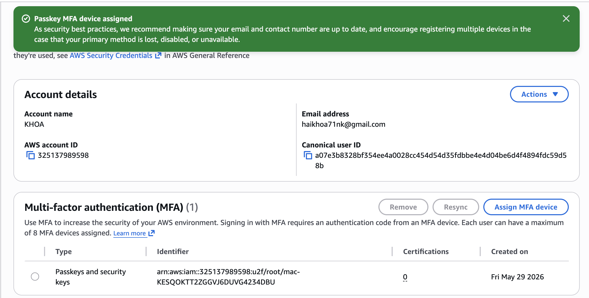

#### Lambda Role Policy

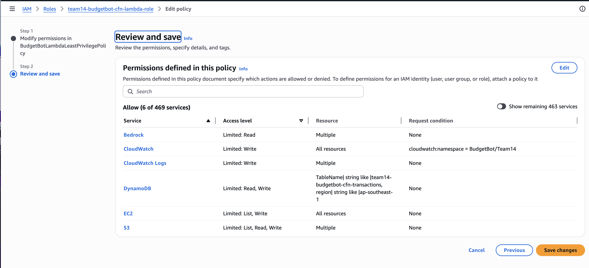

#### Frontend Bucket Private

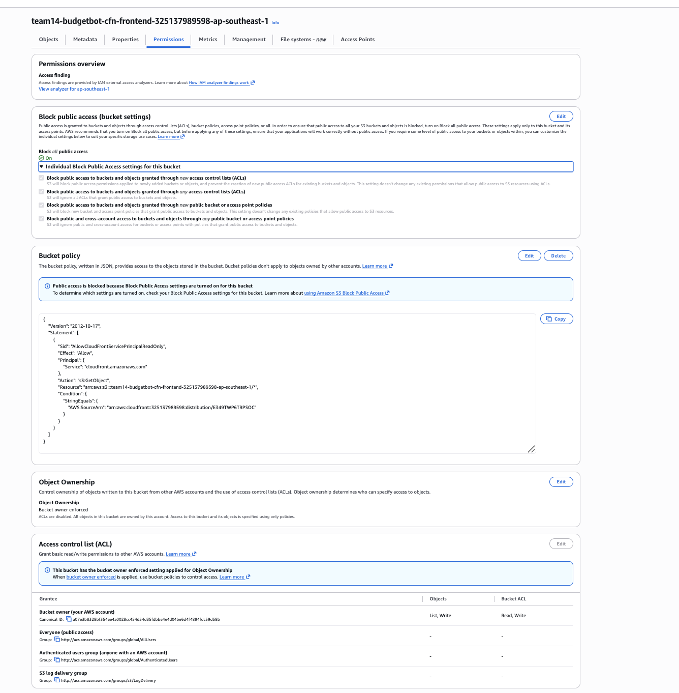

#### Raw Bucket Encryption

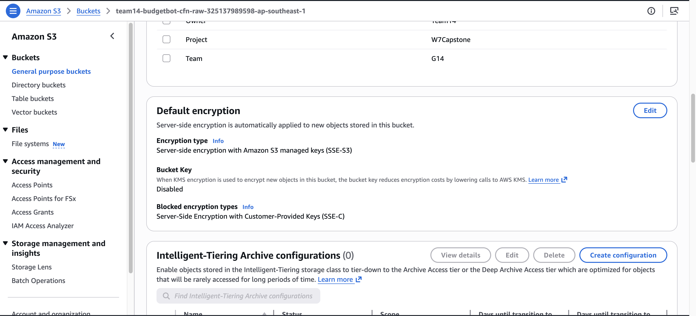

#### CloudFront HTTPS And ACM

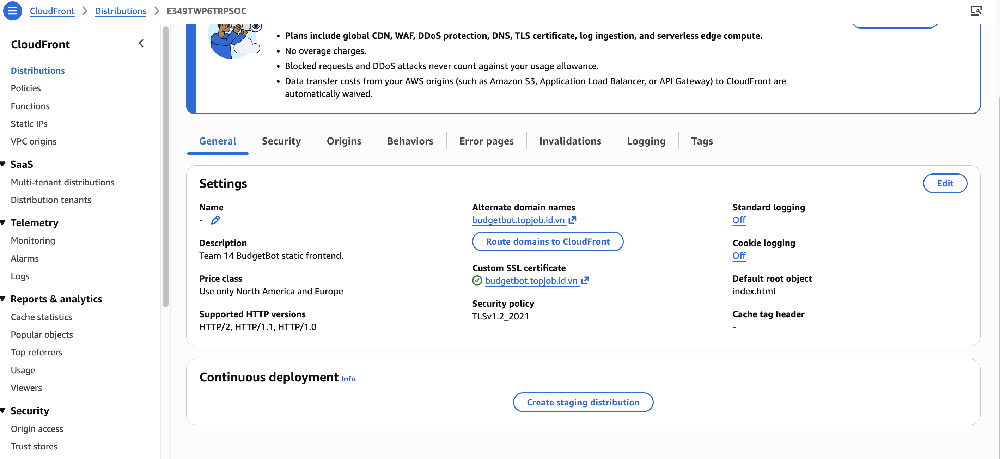

#### DynamoDB Encryption And PITR

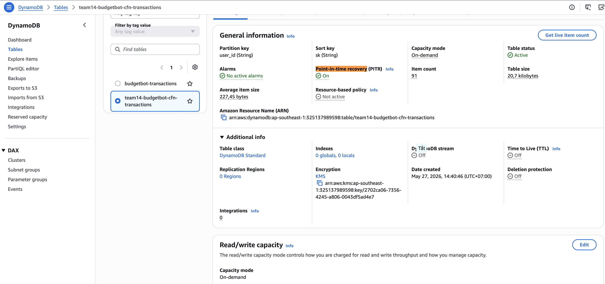

#### VPC Private Subnets And Endpoints

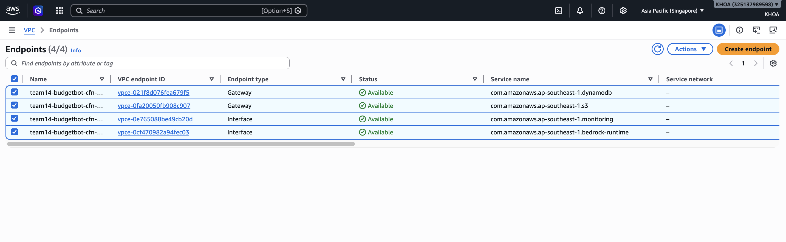

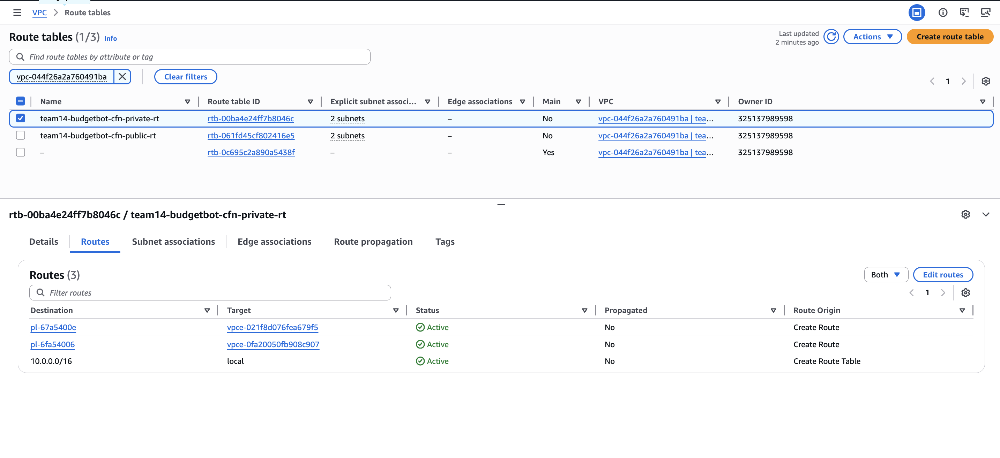

### Lambda IAM Scope

The Lambda execution role allows only the actions required by the demo path:

- S3 raw bucket: `s3:PutObject`, `s3:GetObject`, `s3:ListBucket`
- DynamoDB transactions table: `dynamodb:PutItem`, `dynamodb:GetItem`, `dynamodb:Query`, `dynamodb:UpdateItem`
- Bedrock: `bedrock:InvokeModel` on the selected Nova Micro inference profile/foundation model and a narrowly listed fallback model ARN
- CloudWatch Logs: `logs:CreateLogGroup`, `logs:CreateLogStream`, `logs:PutLogEvents`
- CloudWatch custom metrics: `cloudwatch:PutMetricData` only for namespace `BudgetBot/Team14`
- Lambda VPC attachment: EC2 network-interface actions required for Lambda ENIs

Trade-off: the role still needs `Resource: "*"` for CloudWatch metrics and Lambda ENI operations because those AWS APIs do not support the same fine-grained resource scoping as S3/DynamoDB. The CloudWatch namespace condition limits metric writes.

## 6. Monitoring

Team 14 implemented **Full Observability** as the selected optional capability.

### CloudWatch Dashboard

| Item | Value |
|---|---|
| Dashboard name | `team14-budgetbot-cfn-observability` |
| Dashboard ARN | `arn:aws:cloudwatch::325137989598:dashboard/team14-budgetbot-cfn-observability` |
| Region | ap-southeast-1 |
| Widgets | BudgetBot demo path metrics |

### Custom Metrics

| Metric | Namespace | Unit | Meaning |
|---|---|---|---|
| `UploadSucceeded` | `BudgetBot/Team14` | Count | One successful CSV upload path completed |
| `TransactionsCategorized` | `BudgetBot/Team14` | Count | Number of transactions classified and persisted |
| `LowConfidenceTransactions` | `BudgetBot/Team14` | Count | Number of low-confidence classifications routed to review |
| `BedrockLatencyMs` | `BudgetBot/Team14` | Milliseconds | Classification latency for the upload batch |

### Alarm

| Item | Value |
|---|---|
| Alarm name | `team14-budgetbot-cfn-low-confidence-transactions` |
| State during validation | `OK` |
| Metric | `LowConfidenceTransactions` |
| Threshold | `>= 1` over 300 seconds |
| Treat missing data | `notBreaching` |
| Why this alarm matters | It flags classification quality risk when an upload produces low-confidence transactions. |

### Logs Insights Query

Saved query:

```sql
fields @timestamp, @message
| filter @message like /bedrock_classification_result|cloudwatch_put_metric_data_failed|upload|summary|review/
| sort @timestamp desc
| limit 50
```

Evidence:

- Query definition name: `team14-budgetbot-cfn/upload-classification-path`
- Query definition id: `81030937-11c7-4d22-900e-b13f51a6c9d8`
- Log group: `/aws/lambda/team14-budgetbot-cfn-backend`

### Attached Monitoring Evidence

| Screenshot | File |
|---|---|
| CloudWatch dashboard | `docs/evidence_screenshots/monitoring/01_cloudwatch_dashboard.png` |
| Custom metrics namespace | `docs/evidence_screenshots/monitoring/02_custom_metrics.png` |
| CloudWatch alarm OK | `docs/evidence_screenshots/monitoring/03_alarm_ok.png` |
| Logs Insights saved query | `docs/evidence_screenshots/monitoring/04_logs_insights_query.png` |
| Lambda logs with Bedrock classification result | `docs/evidence_screenshots/monitoring/05_lambda_logs_bedrock_result.png` |

#### CloudWatch Dashboard

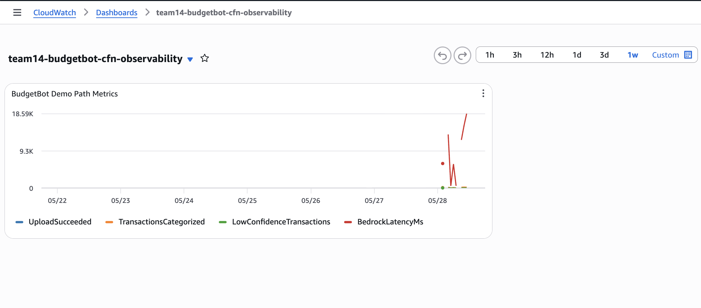

#### Custom Metrics

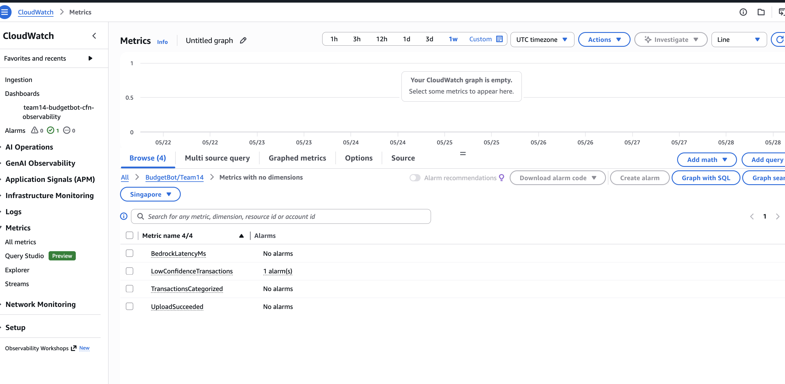

#### CloudWatch Alarm

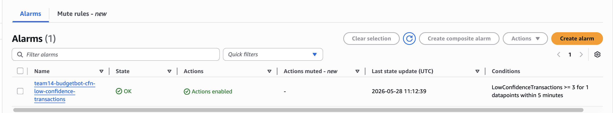

#### Logs Insights Query

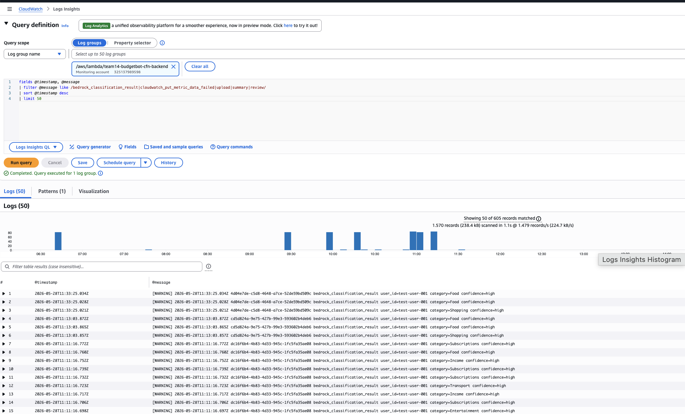

#### Lambda Logs Bedrock Result

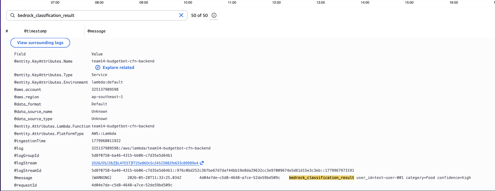

## 6.5 Measurement & Decisions

### DECISION 1 — DynamoDB Over RDS PostgreSQL

**DECISION:** Use DynamoDB PAY_PER_REQUEST table `team14-budgetbot-cfn-transactions` for categorized transactions.

**ALTERNATIVES CONSIDERED:**

- RDS PostgreSQL: stronger SQL aggregation, but adds instance cost, subnet group complexity, backup lifecycle, and connection management.
- SQLite/local file: good for local development, but not persistent/shared in deployed Lambda.

**MEASUREMENT:**

- Current table state: `ACTIVE`.
- Current item count during validation: `91`.
- Billing mode: `PAY_PER_REQUEST`.
- Key schema: `user_id` hash key + `sk` range key.
- Persistent state test: upload data, refresh browser, call `GET /transactions` or `GET /summary`, and the same data remains available from DynamoDB.

**EVIDENCE:**

- AWS CLI: `aws dynamodb describe-table --table-name team14-budgetbot-cfn-transactions`
- CloudFormation: `TransactionsTable` in `infrastructure/cloudformation.yaml`
- API routes: `GET /transactions`, `GET /summary`, `GET /stats`

**TRADE-OFF ACCEPTED:**

DynamoDB does not provide SQL-style `GROUP BY` queries, so the app aggregates category summary in application code after querying the user's transactions. This is acceptable for a hackathon sample and avoids RDS idle cost. At larger scale, we would add GSIs or precomputed monthly summary items.

### DECISION 2 — Amazon Bedrock InvokeModel With Nova Micro Batch Classification

**DECISION:** Use Amazon Bedrock Runtime `InvokeModel` with `apac.amazon.nova-micro-v1:0` for transaction categorization. The prompt requires JSON-only output with `category` and `confidence`.

**ALTERNATIVES CONSIDERED:**

- Local rule-based classifier: zero cloud AI cost but weak on unseen merchants such as `Vietnam Airlines HAN-SGN`, `KFC District 1`, `Cursor Pro`, and opaque POS rows.
- Bedrock Knowledge Base/Agent: useful for document retrieval, but BudgetBot's task is classification of structured CSV rows, not RAG over a corpus.
- Larger model: potentially better accuracy, but higher token cost and not necessary for the scoped demo.

**MEASUREMENT:**

- Local labeled test set: 40 transactions.
- Accuracy report in repo: `28/40 = 70.0%` for the evaluated baseline path.
- Known-brand failure improvement documented: LocalAI `0/7` on listed unseen brands; Bedrock estimated around `6/7`.
- Upload metric validation: sample upload published `TransactionsCategorized` and `LowConfidenceTransactions`.
- Low-confidence fallback: rows with `confidence="low"` appear in `GET /review-queue`.

**EVIDENCE:**

- `supporting_docs/accuracy_report.txt`
- `supporting_docs/failure_cases.md`
- `src/adapters/ai.py` JSON-only prompts
- `src/handlers.py` review queue and custom metrics
- CloudWatch metric `LowConfidenceTransactions`

**TRADE-OFF ACCEPTED:**

The system does not claim perfect automatic classification. Instead, it exposes confidence and makes low-confidence cases reviewable. This is safer for financial data than hiding uncertainty.

### DECISION 3 — No NAT Gateway; Use VPC Endpoints

**DECISION:** Run Lambda in private subnets across two AZs and access AWS services using VPC endpoints instead of a NAT Gateway.

**ALTERNATIVES CONSIDERED:**

- NAT Gateway: simpler generic internet egress, but adds hourly cost and data processing cost.
- Lambda outside VPC: simpler networking, but weaker evidence for network foundation and private service access.

**MEASUREMENT:**

- VPC `vpc-044f26a2a760491ba`.
- Private subnets across two AZs: `10.0.2.0/24` and `10.0.102.0/24`.
- S3 Gateway Endpoint: `vpce-0fa20050fb908c907`.
- DynamoDB Gateway Endpoint: `vpce-021f8d076fea679f5`.
- Bedrock Runtime Interface Endpoint: `vpce-0cf470982a94fec03`.
- CloudWatch Monitoring Interface Endpoint: `vpce-0e765088be49cb20d`.

**EVIDENCE:**

- CloudFormation resources `S3GatewayEndpoint`, `DynamoDbGatewayEndpoint`, `BedrockRuntimeEndpoint`, `CloudWatchMonitoringEndpoint`.
- Private route table has local route plus Gateway Endpoint routes; no `0.0.0.0/0` NAT route.

**TRADE-OFF ACCEPTED:**

Interface endpoints have hourly cost per AZ, but they keep the deployed backend private and avoid NAT Gateway cost. Because the app only calls AWS services, no general internet egress is needed.

## 7. Lessons Learned

The biggest lesson was that a working AI SaaS demo is mostly about scope control and evidence, not adding every possible feature. BudgetBot started from the starter app, but the team had to make real deployment choices: Lambda instead of ECS/EC2, DynamoDB instead of RDS, direct Bedrock InvokeModel instead of a Knowledge Base, and VPC endpoints instead of NAT Gateway. These choices kept the system small enough to ship while still covering all seven mandatory W7 capabilities.

The hardest product issue was classification uncertainty. Some transactions are easy, such as coffee shops or airlines, but opaque descriptions like `Unknown merchant POS` do not contain enough signal for any model to classify confidently. The fix was not to pretend the AI is always right. The app returns a confidence value, sends low-confidence rows to a review queue, and supports user correction through `POST /correct`. That turns an AI failure mode into an explainable product workflow.

If we had another sprint, we would add real user authentication with Cognito, monthly budget goals, alerting when a category exceeds the user's cap, recurring transaction detection, and a precomputed monthly summary table for larger datasets.

## 8. Teardown Plan

Teardown deadline: **Sunday 1/6 EOD**. Commit confirmation to `docs/teardown_confirmation.md` and add a Monday Cost Explorer screenshot.

### Teardown Order

1. Disable or remove custom DNS aliases if deleting CloudFront.
2. Delete CloudFormation stack `team14-budgetbot-iac`.
3. If stack deletion fails on S3, empty these buckets first:
   - `team14-budgetbot-cfn-frontend-325137989598-ap-southeast-1`
   - `team14-budgetbot-cfn-raw-325137989598-ap-southeast-1`
   - `team14-budgetbot-artifacts-325137989598-ap-southeast-1`
4. Delete CloudFront distribution `E349TWP6TRPSOC` after disabling it if needed.
5. Delete API Gateway `mlhwir8gc5`.
6. Delete Lambda function `team14-budgetbot-cfn-backend`.
7. Delete DynamoDB table `team14-budgetbot-cfn-transactions` if still present.
8. Delete CloudWatch dashboard, alarm, saved query, and Lambda log group.
9. Delete VPC endpoints, subnets, route tables, security groups, internet gateway, and VPC last.
10. Review Route 53 hosted zones and remove the redundant `budgetbot.topjob.id.vn` hosted zone if it is not needed.
11. Verify Cost Explorer on Monday 2/6 and commit the screenshot.

### Teardown Command Starting Point

```bash
aws cloudformation delete-stack \
  --profile hackathon \
  --region ap-southeast-1 \
  --stack-name team14-budgetbot-iac

aws cloudformation wait stack-delete-complete \
  --profile hackathon \
  --region ap-southeast-1 \
  --stack-name team14-budgetbot-iac
```

## Appendix A — Live Validation Commands

```bash
curl -I https://budgetbot.topjob.id.vn
curl https://mlhwir8gc5.execute-api.ap-southeast-1.amazonaws.com/health

aws cloudformation describe-stacks \
  --profile hackathon \
  --region ap-southeast-1 \
  --stack-name team14-budgetbot-iac

aws cloudwatch describe-alarms \
  --profile hackathon \
  --region ap-southeast-1 \
  --alarm-names team14-budgetbot-cfn-low-confidence-transactions

aws dynamodb describe-continuous-backups \
  --profile hackathon \
  --region ap-southeast-1 \
  --table-name team14-budgetbot-cfn-transactions
```

## Appendix B — Source Requirements Used

This Evidence Pack was prepared against:

- `W7/W7_project_announcement.md`
- `W7/W7_learner_guide.md`
- `W7/W7_hackathon_rules.txt`
- `W7/W7_cost_estimates.md`
- `W7/starter_apps/README.md`
